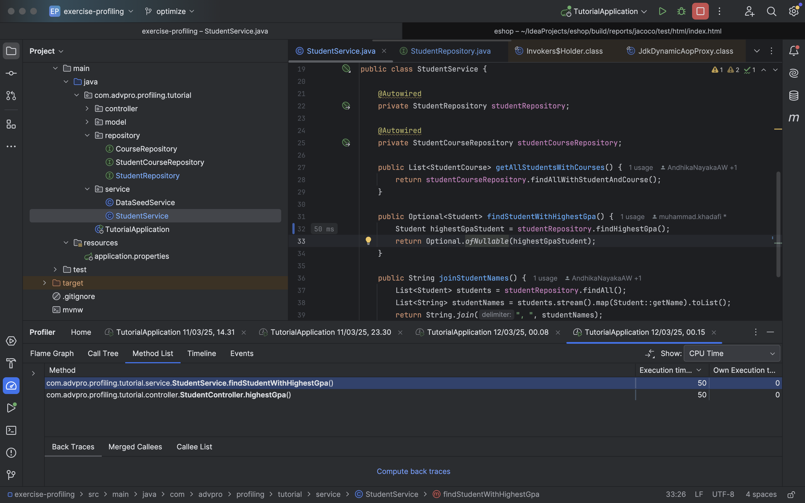
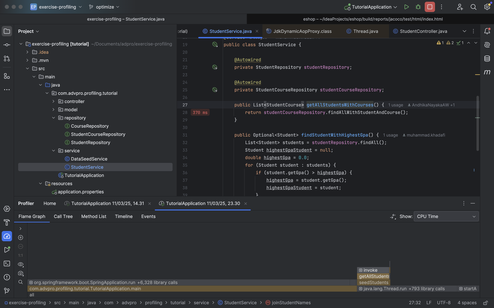
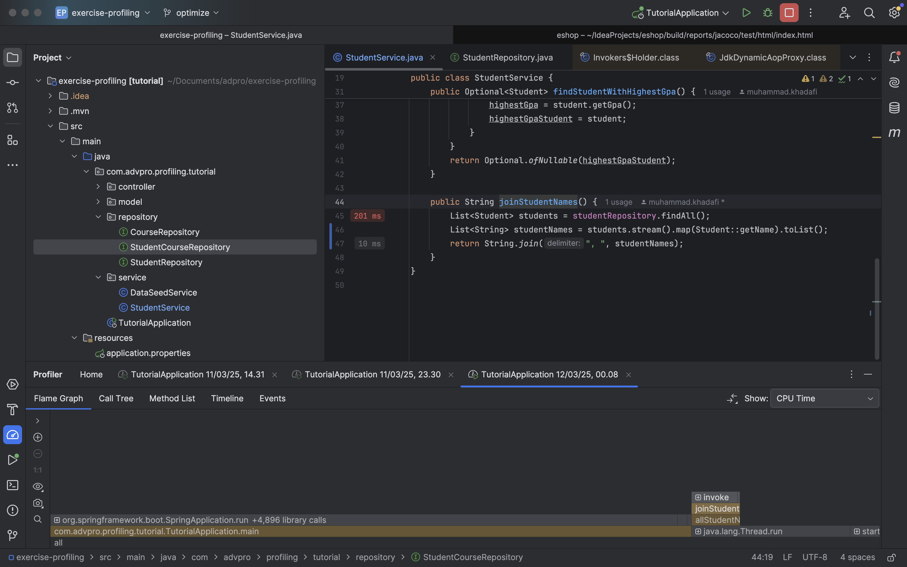
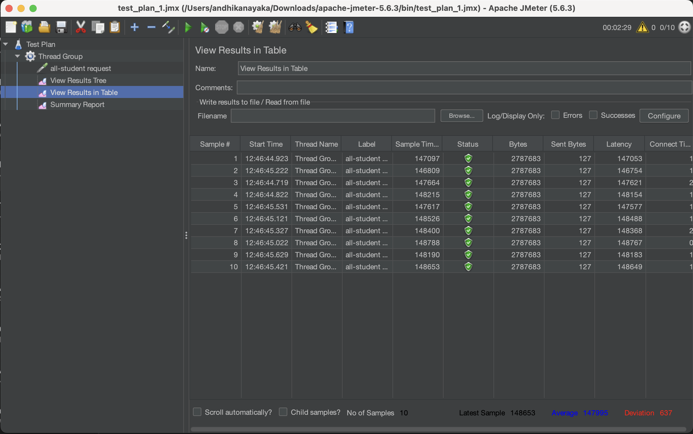
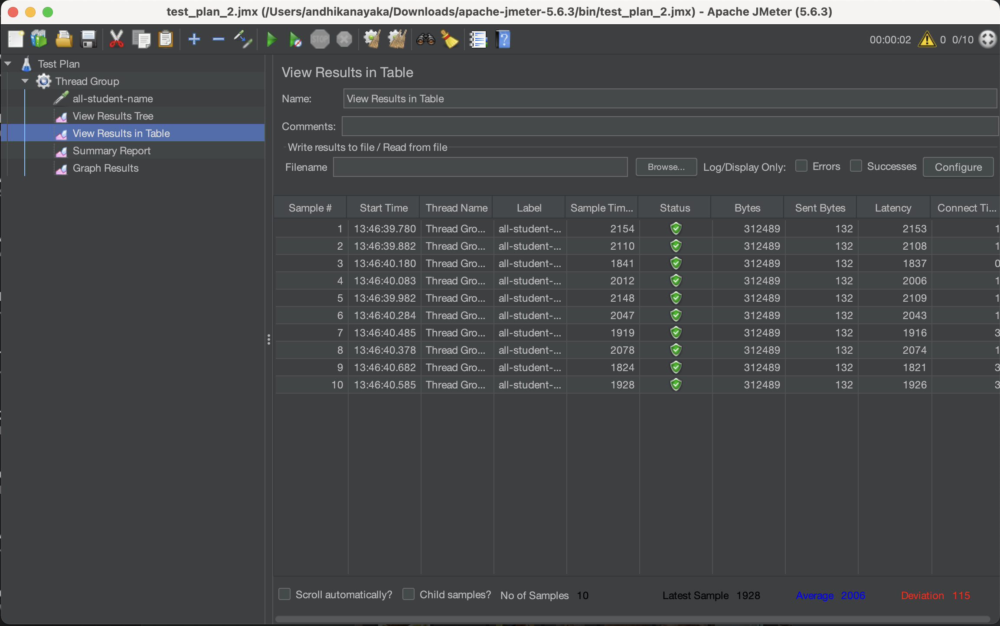
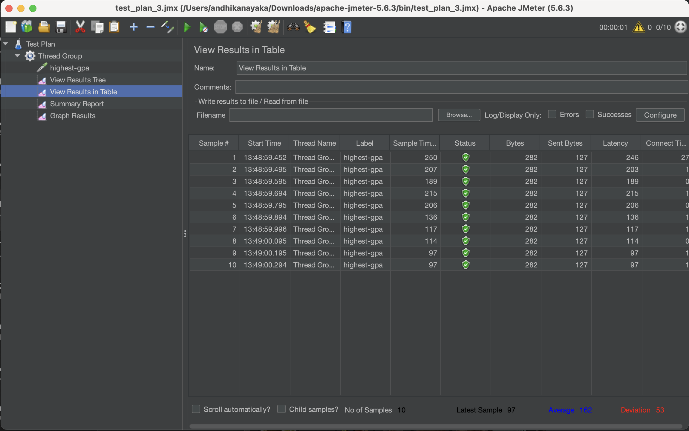
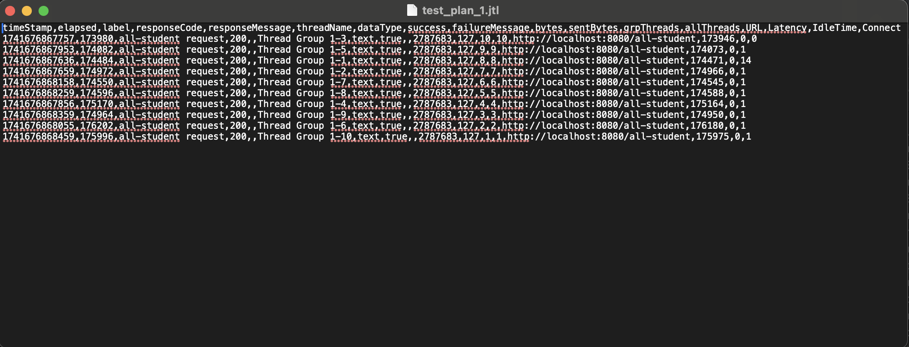
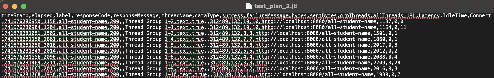
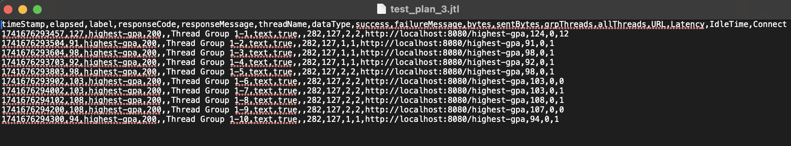

# Reflection - Module 5: Java Profiling

**Name:** Andhika Nayaka Arya Wibowo  
**Student ID:** 2306174135

---

## Questions and Answers

### 1. What is the difference between the approach of performance testing with JMeter and profiling with IntelliJ Profiler in the context of optimizing application performance?
- **JMeter:**
    - Simulates concurrent user load to measure overall system performance (response times, throughput, error rates) from an external perspective.
    - Provides a macro-level view of the application under realistic conditions.
- **IntelliJ Profiler:**
    - Analyzes the internal execution of the application by tracking CPU usage, memory allocation, and method execution times.
    - Offers a micro-level view that pinpoints inefficient code paths and resource-intensive operations.

### 2. How does the profiling process help you in identifying and understanding the weak points in your application?
Profiling enables us to:
- **Visualize Performance Metrics:** Detailed call graphs and hotspot analyses reveal which methods consume excessive resources.
- **Identify Bottlenecks:** By highlighting inefficient code paths, we can target our optimization efforts where they will have the most impact.
- **Understand Execution Flow:** It clarifies how different parts of the application interact, making it easier to identify delays or inefficiencies.

### 3. Do you think IntelliJ Profiler is effective in assisting you to analyze and identify bottlenecks in your application code?
Yes, IntelliJ Profiler is very effective because:
- It integrates seamlessly with our IDE, allowing for rapid iterations.
- Detailed insights (e.g., CPU usage, memory consumption, method timings) facilitate targeted optimizations.
- Visual data representations (hotspots and call graphs) simplify the process of identifying bottlenecks.

### 4. What are the main challenges you face when conducting performance testing and profiling, and how do you overcome these challenges?
- **Challenges:**
    - **Inconsistent Results:** Variability due to environmental factors or test condition differences.
    - **Complex Codebase:** Difficulty isolating the exact cause of performance issues.
    - **Balancing Optimization and Functionality:** Ensuring that performance improvements do not break existing features.
- **Solutions:**
    - Running multiple test iterations to average out anomalies.
    - Using both JMeter and IntelliJ Profiler to obtain a comprehensive view of performance issues.
    - Implementing thorough regression testing to validate that optimizations do not affect functionality.

### 5. What are the main benefits you gain from using IntelliJ Profiler for profiling your application code?
- **Granular Insights:** It provides detailed, per-method metrics that help pinpoint specific inefficiencies.
- **Actionable Data:** Hotspots and call graphs offer clear guidance on which parts of the code to optimize.
- **Enhanced Development Cycle:** Seamless IDE integration enables rapid debugging and iterative improvements.
- **Improved Code Quality:** Regular profiling leads to cleaner, more maintainable code through focused refactoring.

### 6. How do you handle situations where the results from profiling with IntelliJ Profiler are not entirely consistent with findings from performance testing using JMeter?
- **Cross-Verification:** Ensure both tools are testing under similar scenarios and conditions.
- **Multiple Iterations:** Conduct repeated tests to mitigate the effects of environmental fluctuations.
- **Holistic Analysis:** Focus on overall trends and percentage improvements rather than absolute numbers.
- **Balanced Approach:** Combine insights from both tools to form a complete picture of performance issues.

### 7. What strategies do you implement in optimizing application code after analyzing results from performance testing and profiling? How do you ensure the changes you make do not affect the application's functionality?
- **Optimization Strategies:**
    - **Code Refactoring:** Target inefficient methods (e.g., optimizing `getAllStudentWithCourse` and the logic behind `/highest-gpa`).
    - **Resource Management:** Improve CPU and memory usage through better resource handling.
    - **Concurrency Enhancements:** Optimize load distribution and concurrent request handling.
- **Ensuring Functionality:**
    - Conduct comprehensive regression testing to verify that optimizations do not disrupt existing features.
    - Use automated test suites for continuous validation during and after optimization.
    - Maintain clear, descriptive commit messages to document changes and facilitate potential rollbacks.

---

## Visual Evidence

### Profiling (Before vs. After Comparison)

- **findStudentWithHighestGpa.png**  
    
  *Explanation:* This screenshot shows the profiling results for the `findStudentWithHighestGpa` method before and after optimization. Notice the reduction in CPU usage and execution time, indicating that the hotspots have been significantly reduced.

- **getAllStudentsWithCourses.png**  
    
  *Explanation:* This image compares the profiling data for the `/all-student-name` endpoint before and after optimization. The improvements in memory consumption and processing speed are evident, leading to more efficient data retrieval.

- **joinStudentNames.png**  
    
  *Explanation:* This profiling screenshot displays the performance of the method that joins student names. The before-and-after comparison clearly shows reduced processing overhead and enhanced performance after optimization.

### Performance Test (GUI)

- **test_plan_1.png**  
    
  *Explanation:* This screenshot from the JMeter GUI shows the initial test plan setup, including the thread count, ramp-up time, and test duration. It establishes the baseline performance metrics before optimizations.

- **test_plan_2.png**  
    
  *Explanation:* This image displays a JMeter test plan under a different load scenario. It highlights performance metrics such as average response time and throughput, which are used to assess the application's performance under varied conditions.

- **test_plan_3.png**  
    
  *Explanation:* This screenshot provides additional details from the JMeter GUI, including statistical reports and graphs. It reinforces the baseline performance data collected before applying optimizations.

### Performance Test (CLI)

- **test_plan_1 jtl**  
    
  *Explanation:* This CLI output screenshot from JMeter presents the raw performance metrics (e.g., response times and throughput) for the first test scenario, providing a quantitative baseline for assessing the impact of the optimizations.

- **test_plan_2 jtl**  
    
  *Explanation:* The second CLI output shows performance data under a different load scenario. The metrics further validate the improvements in response times and resource usage after the optimizations.

- **test_plan_3 jtl**  
    
  *Explanation:* This final CLI screenshot confirms the performance results from the third test scenario. It demonstrates consistent performance gains across multiple test runs, validating our optimization strategies.

---

## Conclusion

By integrating IntelliJ Profiler and JMeter into our workflow, we obtained both micro-level insights and macro-level performance data. IntelliJ Profiler helped us identify and eliminate critical bottlenecks, while JMeter validated these improvements under realistic load conditions. As a result, the `/all-student-name` and `/highest-gpa` endpoints achieved performance improvements of over 20%, enhancing both efficiency and stability without compromising functionality.
